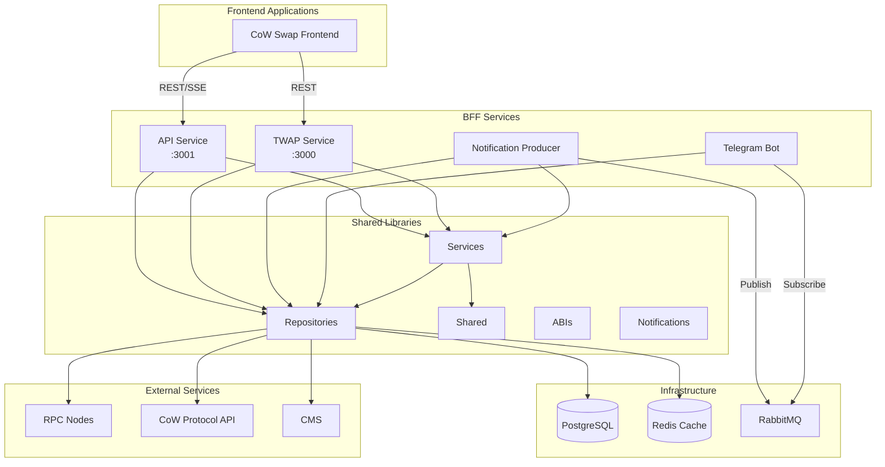
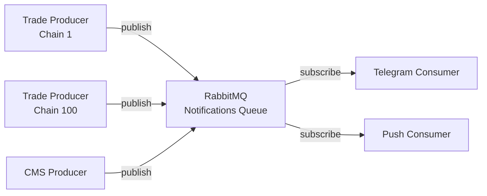
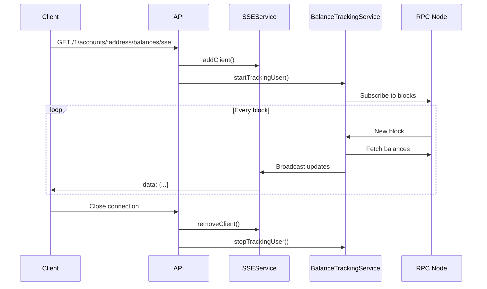

The CoW Protocol Backend for Frontend (BFF) is built as a modern TypeScript monorepo using NX, designed to provide a suite of backend services that enhance the frontend user experience.

## High-Level Architecture



## Monorepo Structure

The BFF uses NX to manage a monorepo containing multiple applications and shared libraries:

```
bff/
├── apps/                          # Application services
│   ├── api/                       # Main REST API service
│   ├── notification-producer/     # Event monitoring & notification generation
│   ├── telegram/                  # Telegram bot consumer
│   └── twap/                      # Time-Weighted Average Price service
├── libs/                          # Shared libraries
│   ├── abis/                      # Smart contract ABIs
│   ├── notifications/             # Notification templates & logic
│   ├── repositories/              # Data access layer
│   ├── services/                  # Business logic layer
│   └── shared/                    # Common utilities & types
├── nx.json                        # NX workspace configuration
└── package.json                   # Root dependencies
```

### Workspace Configuration

The NX workspace is configured in `nx.json` with:

- **Apps Directory**: `apps/` - Contains deployable applications
- **Libs Directory**: `libs/` - Contains shared libraries
- **Cacheable Operations**: `build`, `lint`, `test`, `e2e`
- **Task Dependencies**: Builds depend on library builds (via `^build`)

## Applications

The BFF consists of four main applications:

### 1. API Service (`apps/api`)

<Info>
**Entry Point**: `apps/api/src/main.ts`  
**Default Port**: 3001  
**Framework**: Fastify with TypeScript
</Info>

The primary REST API service that provides:

- **Token Balance Queries**: Real-time and historical balance data
- **Server-Sent Events (SSE)**: Live balance updates for connected clients
- **Slippage Tolerance**: Market analysis for optimal trading parameters
- **Simulation**: Transaction simulation via Tenderly
- **Proxy Endpoints**: CoW Protocol API and CoinGecko proxying
- **Hooks Information**: On-chain hooks metadata
- **Affiliate Program**: Referral tracking and statistics

**Key Features**:
- Auto-loaded routes from `src/app/routes/` directory
- Swagger/OpenAPI documentation at `/docs`
- Dependency injection via Inversify
- Plugin-based architecture using Fastify's plugin system

**Example Route Structure**:
```
GET /:chainId/accounts/:userAddress/balances
GET /:chainId/accounts/:userAddress/balances/sse
GET /:chainId/markets/:baseToken-:quoteToken/slippageTolerance
POST /:chainId/simulation/simulateBundle
```

### 2. Notification Producer (`apps/notification-producer`)

<Info>
**Entry Point**: `apps/notification-producer/src/main.ts`  
**Dependencies**: PostgreSQL, RabbitMQ, CMS
</Info>

Monitors blockchain events and generates push notifications for:

- **Trade Notifications**: Order fills and trade executions
- **Expired Orders**: Orders that have reached expiration
- **CMS Notifications**: Manual push notifications from the CMS

**Architecture Pattern**:
```typescript
interface Runnable {
  start(): Promise<void>;
  stop(): Promise<void>;
}

class TradeNotificationProducer implements Runnable {
  // Polls CoW Protocol API for new trades
  // Publishes notifications to RabbitMQ
}
```

**Chain Configuration**:
```bash
# Run for specific chains only
NOTIFICATIONS_PRODUCER_CHAINS=1,100  # Mainnet and Gnosis

# If not specified, runs for all supported chains
```

### 3. Telegram Bot (`apps/telegram`)

<Info>
**Entry Point**: `apps/telegram/src/main.ts`  
**Dependencies**: RabbitMQ, Telegram Bot API
</Info>

Consumes notifications from RabbitMQ and delivers them to users via Telegram:

- Subscribes to the notification queue
- Formats messages with user-friendly templates
- Handles user interactions and subscriptions
- Manages delivery failures and retries

### 4. TWAP Service (`apps/twap`)

<Info>
**Entry Point**: `apps/twap/src/main.ts`  
**Default Port**: 3000
</Info>

Provides Time-Weighted Average Price calculations:

- Historical price data aggregation
- TWAP calculation endpoints
- Separate database for price history
- Independent migration system

## Shared Libraries

The monorepo leverages shared libraries to promote code reuse and maintain clear architectural boundaries:

### Repositories Layer (`libs/repositories`)

<Note>
The repositories layer implements the **Repository Pattern** for data access abstraction.
</Note>

**Purpose**: Data access and external service integration

**Key Repositories**:

| Repository | Purpose | Implementations |
|------------|---------|----------------|
| `Erc20Repository` | Token metadata and interactions | Viem, Cache, Fallback, Native |
| `UsdRepository` | Token price data | CoW API, CoinGecko, Cache, Fallback |
| `UserBalanceRepository` | User token balances | Viem, Cache |
| `TokenBalancesRepository` | Batch balance queries | Moralis, Alchemy |
| `TokenHolderRepository` | Top token holders | Moralis, GoldRush, Ethplorer, Cache |
| `SimulationRepository` | Transaction simulation | Tenderly |
| `CacheRepository` | Caching abstraction | Redis, Memory |
| `PushNotificationsRepository` | Notification storage | PostgreSQL |
| `PushSubscriptionsRepository` | User subscriptions | CMS |
| `DuneRepository` | Analytics queries | Dune API |

**Implementation Pattern**:
```typescript
// Interface definition
export interface Erc20Repository {
  getToken(chainId: number, address: string): Promise<Token>;
  getTokens(chainId: number, addresses: string[]): Promise<Token[]>;
}

// Multiple implementations
export class Erc20RepositoryViem implements Erc20Repository { }
export class Erc20RepositoryCache implements Erc20Repository { }
export class Erc20RepositoryFallback implements Erc20Repository { }
```

**Fallback Pattern**:
Many repositories implement a fallback chain for resilience:
```typescript
getErc20Repository(cache) {
  return new Erc20RepositoryCache(
    new Erc20RepositoryFallback([
      new Erc20RepositoryViem(),
      new Erc20RepositoryNative(),
    ]),
    cache
  );
}
```

### Services Layer (`libs/services`)

<Note>
The services layer implements **business logic** and orchestrates repository calls.
</Note>

**Purpose**: Business logic, orchestration, and complex operations

**Key Services**:

| Service | Purpose | Dependencies |
|---------|---------|-------------|
| `SlippageService` | Calculate optimal slippage | UsdRepository |
| `TokenBalancesService` | Fetch user balances | Erc20Repository, UserBalanceRepository |
| `TokenHolderService` | Top holder analysis | TokenHolderRepository |
| `UsdService` | Price conversions | UsdRepository |
| `SimulationService` | Transaction simulation | SimulationRepository |
| `SSEService` | Server-Sent Events management | In-memory client registry |
| `BalanceTrackingService` | Real-time balance monitoring | UserBalanceRepository, SSEService |
| `HooksService` | Hook metadata | DuneRepository |
| `AffiliateStatsService` | Referral statistics | DuneRepository, Cache |

**Example Service**:
```typescript
@injectable()
export class TokenBalancesServiceMain implements TokenBalancesService {
  constructor(
    @inject(erc20RepositorySymbol) private erc20Repository: Erc20Repository,
    @inject(userBalanceRepositorySymbol) private userBalanceRepository: UserBalanceRepository
  ) {}

  async getUserTokenBalances(params: GetUserTokenBalancesParams) {
    // Orchestrate calls to multiple repositories
    const tokens = await this.erc20Repository.getTokens(params.chainId, params.tokenAddresses);
    const balances = await this.userBalanceRepository.getBalances(params);
    
    // Combine and format results
    return this.formatBalances(tokens, balances);
  }
}
```

### Shared Library (`libs/shared`)

**Purpose**: Common utilities, types, and constants

**Contents**:
- **Logger**: Pino-based structured logging
- **Constants**: Chain IDs, addresses, configurations
- **Types**: Shared TypeScript interfaces and types
- **Transformers**: Data transformation utilities
- **Utils**: Helper functions for addresses, parsing, validation

### Other Libraries

- **`libs/abis`**: Smart contract ABIs for on-chain interactions
- **`libs/notifications`**: Notification templates and formatting logic

## Dependency Injection with Inversify

The BFF uses [Inversify](https://inversify.io/) for dependency injection, promoting loose coupling and testability.

### Container Configuration

**Location**: `apps/api/src/app/inversify.config.ts`

```typescript
import { Container } from 'inversify';

function getApiContainer(): Container {
  const apiContainer = new Container();

  // Bind repositories
  const cacheRepository = getCacheRepository();
  const erc20Repository = getErc20Repository(cacheRepository);
  
  apiContainer
    .bind<Erc20Repository>(erc20RepositorySymbol)
    .toConstantValue(erc20Repository);

  // Bind services
  apiContainer
    .bind<SlippageService>(slippageServiceSymbol)
    .to(SlippageServiceMain);

  apiContainer
    .bind<SSEService>(sseServiceSymbol)
    .to(SSEServiceMain)
    .inSingletonScope();  // Singleton for stateful services

  return apiContainer;
}

export const apiContainer = getApiContainer();
```

### Symbols for Type-Safe Injection

Each injectable type has a unique symbol:

```typescript
export const erc20RepositorySymbol = Symbol.for('Erc20Repository');
export const slippageServiceSymbol = Symbol.for('SlippageService');
export const sseServiceSymbol = Symbol.for('SSEService');
```

### Using Dependency Injection in Routes

```typescript
import { apiContainer } from '../../../inversify.config';
import { TokenBalancesService, tokenBalancesServiceSymbol } from '@cowprotocol/services';

const tokenBalancesService: TokenBalancesService = apiContainer.get(
  tokenBalancesServiceSymbol
);

const handler: FastifyPluginAsync = async (fastify) => {
  fastify.get('/', async (request, reply) => {
    const balances = await tokenBalancesService.getUserTokenBalances({
      chainId: request.params.chainId,
      userAddress: request.params.userAddress,
      tokenAddresses: request.query.tokens.split(',')
    });
    
    return reply.send(balances);
  });
};
```

### Injectable Services

Services use decorators for dependency injection:

```typescript
import { injectable, inject } from 'inversify';

@injectable()
export class SlippageServiceMain implements SlippageService {
  constructor(
    @inject(usdRepositorySymbol) private usdRepository: UsdRepository,
    @inject('Logger') private logger: Logger
  ) {}

  async calculateSlippage(params: SlippageParams): Promise<SlippageResult> {
    this.logger.info({ params }, 'Calculating slippage');
    const prices = await this.usdRepository.getPrices(params.tokens);
    // ... calculation logic
  }
}
```

## Database Architecture

### Main Database (PostgreSQL)

**Managed by**: TypeORM in `libs/repositories`

**Tables**:
- `indexer_state`: Track blockchain indexing progress
- `onchain_placed_orders`: Orders placed on-chain
- `expired_orders`: Expired order tracking
- `orders_app_data`: Order metadata
- `push_notifications`: Notification history

**Migration Management**:
```bash
# Create migration
yarn typeorm migration:create src/migrations/your-migration-name

# Or generate from entities
yarn migration:generate

# Run migrations
yarn migration:run

# Revert last migration
yarn migration:revert
```

**Migration Location**: `libs/repositories/src/migrations/`

### TWAP Database (PostgreSQL)

**Managed by**: Separate TypeORM configuration in `apps/twap`

**Purpose**: Store historical price data for TWAP calculations

```bash
# TWAP-specific migrations
yarn twap:run-migrations
yarn twap:generate-migrations
```

## Caching Strategy

### Multi-Level Caching

The BFF implements a flexible caching strategy:

```typescript
export interface CacheRepository {
  get<T>(key: string): Promise<T | null>;
  set<T>(key: string, value: T, ttl?: number): Promise<void>;
  delete(key: string): Promise<void>;
}

// Redis implementation (production)
export class CacheRepositoryRedis implements CacheRepository { }

// In-memory implementation (development/fallback)
export class CacheRepositoryMemory implements CacheRepository { }
```

### Cache Wrapping Pattern

Repositories wrap other repositories to add caching:

```typescript
export class Erc20RepositoryCache implements Erc20Repository {
  constructor(
    private inner: Erc20Repository,
    private cache: CacheRepository
  ) {}

  async getToken(chainId: number, address: string): Promise<Token> {
    const cacheKey = `erc20:${chainId}:${address}`;
    
    // Try cache first
    const cached = await this.cache.get<Token>(cacheKey);
    if (cached) return cached;
    
    // Fallback to inner repository
    const token = await this.inner.getToken(chainId, address);
    
    // Store in cache
    await this.cache.set(cacheKey, token, 3600);
    
    return token;
  }
}
```

## Messaging with RabbitMQ

### Queue Architecture



### Producer Pattern

```typescript
export class TradeNotificationProducer implements Runnable {
  async start(): Promise<void> {
    while (!this.shouldStop) {
      // Poll for new trades
      const trades = await this.fetchNewTrades();
      
      // Generate notifications
      for (const trade of trades) {
        const notification = await this.createNotification(trade);
        
        // Publish to queue
        await this.publishToQueue(notification);
      }
      
      await this.sleep(this.pollInterval);
    }
  }
}
```

### Consumer Pattern

```typescript
export class TelegramConsumer {
  async start(): Promise<void> {
    const channel = await this.connection.createChannel();
    await channel.assertQueue('notifications');
    
    channel.consume('notifications', async (msg) => {
      const notification = JSON.parse(msg.content.toString());
      
      // Send to Telegram
      await this.sendTelegramMessage(notification);
      
      // Acknowledge message
      channel.ack(msg);
    });
  }
}
```

## Server-Sent Events (SSE) Architecture

The BFF implements real-time balance updates using Server-Sent Events:



### SSE Implementation

**SSE Service** (manages connections):
```typescript
@injectable()
export class SSEServiceMain implements SSEService {
  private clients = new Map<string, SSEClient>();

  addClient(client: SSEClient): void {
    this.clients.set(client.clientId, client);
  }

  sendToClient(clientId: string, data: string): boolean {
    const client = this.clients.get(clientId);
    if (!client) return false;
    
    try {
      client.send(`data: ${data}\n\n`);
      return true;
    } catch (error) {
      this.removeClient(clientId);
      return false;
    }
  }
}
```

**Balance Tracking Service** (monitors balances):
```typescript
@injectable()
export class BalanceTrackingServiceMain implements BalanceTrackingService {
  async startTrackingUser(params: TrackingParams): Promise<void> {
    // Subscribe to new blocks
    const provider = this.getProvider(params.chainId);
    
    provider.on('block', async (blockNumber) => {
      // Fetch updated balances
      const balances = await this.userBalanceRepository.getBalances(params);
      
      // Broadcast to all clients for this user
      const clients = this.sseService.getClientsForUser(
        params.chainId,
        params.userAddress
      );
      
      for (const client of clients) {
        this.sseService.sendToClient(client.clientId, JSON.stringify(balances));
      }
    });
  }
}
```

## Build and Development Tools

### NX Task Graph

NX automatically manages build dependencies:

```bash
# Build only affected projects
yarn build

# Run tests for affected projects
yarn test

# Lint affected projects
yarn lint
```

### Docker Build System

Each application has its own Dockerfile:

```bash
# Build affected Docker images
yarn docker-build:affected

# Build and start all services
yarn compose:up
```

### Type Generation

API types are automatically generated from Swagger specs:

```bash
# Manual type generation
yarn gen:types

# Runs automatically after install
yarn install  # triggers postinstall -> gen:types
```

## Design Patterns Summary

<CardGroup cols={2}>
  <Card title="Repository Pattern" icon="database">
    Data access abstraction with multiple implementations (Viem, Cache, Fallback)
  </Card>
  
  <Card title="Dependency Injection" icon="plug">
    Inversify container for loose coupling and testability
  </Card>
  
  <Card title="Decorator Pattern" icon="layer-group">
    Cache and fallback wrapping of repositories
  </Card>
  
  <Card title="Factory Pattern" icon="industry">
    Service factories for creating configured instances
  </Card>
  
  <Card title="Observer Pattern" icon="bell">
    Event-driven notification system with RabbitMQ
  </Card>
  
  <Card title="Singleton Pattern" icon="circle-dot">
    Stateful services (SSEService, BalanceTrackingService)
  </Card>
</CardGroup>

## Performance Considerations

### Caching Strategy

- **Token Metadata**: Cached indefinitely (rarely changes)
- **Price Data**: 2-5 minute TTL depending on volatility
- **User Balances**: Short TTL (30s) or real-time via SSE
- **Top Holders**: 1-hour TTL (expensive queries)

### Rate Limiting

External API calls are rate-limited:

- **RPC Nodes**: Batch multiple requests when possible
- **CoinGecko**: Cache aggressively (150s default)
- **Dune Analytics**: Long-lived cache (1 hour default)

### Connection Pooling

- **PostgreSQL**: TypeORM connection pool
- **Redis**: IORedis with connection pooling
- **RabbitMQ**: Channel pooling for producers

## Security Considerations

<Warning>
**Never commit secrets**: Use `.env` files which are gitignored. Never hardcode API keys or passwords.
</Warning>

### Environment Variable Validation

Fastify validates environment variables on startup:

```typescript
const envSchema = {
  type: 'object',
  required: ['DATABASE_PASSWORD'],
  properties: {
    DATABASE_PASSWORD: { type: 'string' }
  }
};

fastify.register(fastifyEnv, { schema: envSchema });
```

### Input Validation

All routes use JSON Schema for input validation:

```typescript
const paramsSchema = {
  type: 'object',
  required: ['chainId', 'userAddress'],
  properties: {
    chainId: SupportedChainIdSchema,
    userAddress: AddressSchema,  // Validates Ethereum address format
  },
} as const satisfies JSONSchema;
```

### CORS Configuration

Configured via `AUTHORIZED_ORIGINS` environment variable:

```bash
AUTHORIZED_ORIGINS=cow.fi,swap.cow.fi
```

## Next Steps

<CardGroup cols={2}>
  <Card title="API Reference" icon="book" href="/api-reference/introduction">
    Explore all available endpoints
  </Card>
  <Card title="Deployment Guide" icon="server" href="/deployment/docker">
    Deploy to production environments
  </Card>
  <Card title="Development Setup" icon="code" href="/development/setup">
    Set up your development environment
  </Card>
  <Card title="Testing Guide" icon="vial" href="/development/testing">
    Write and run tests for BFF services
  </Card>
</CardGroup>