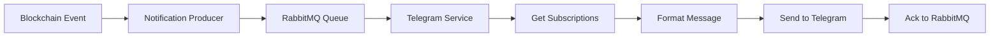

The Telegram Bot Service is a consumer application that listens to the notification queue and delivers push notifications to users via Telegram. It handles message formatting, subscription management, and ensures reliable delivery.

## Purpose and Responsibilities

The Telegram service provides:

- **Notification Delivery**: Consumes notifications from RabbitMQ and sends them to Telegram
- **Subscription Management**: Caches user subscriptions for efficient lookup
- **Message Formatting**: Converts notifications to Telegram-compatible HTML with markdown support
- **Multi-User Support**: Sends notifications to all subscribed chat IDs for each account
- **Retry Logic**: Handles temporary failures with automatic retry

## How to Run

### Development

```bash
# Start required dependencies
docker-compose up -d queue  # RabbitMQ
docker-compose up -d db     # PostgreSQL (for subscriptions)

# Set Telegram bot token
export TELEGRAM_SECRET=your_bot_token_from_botfather

# Start the Telegram consumer
yarn telegram
```

### Production

```bash
# Build the application
yarn build telegram

# Start the consumer
TELEGRAM_SECRET=your_bot_token node dist/apps/telegram/main.js
```

### Docker

```bash
# Build the Docker image
docker build -f apps/telegram/Dockerfile . -t telegram

# Run the container
docker run \
  -e TELEGRAM_SECRET=your_bot_token \
  -e QUEUE_HOST=rabbitmq \
  -e DATABASE_HOST=postgres \
  telegram
```

## Key Configuration Options

### Telegram Configuration

| Variable | Description | Required |
|----------|-------------|----------|
| `TELEGRAM_SECRET` | Bot token from @BotFather | **Yes** |

**Getting a Bot Token**:
1. Message @BotFather on Telegram
2. Send `/newbot` command
3. Follow the prompts to create your bot
4. Copy the token provided

### RabbitMQ Configuration

```bash
QUEUE_HOST=localhost
QUEUE_PORT=5672
QUEUE_USER=rabbit
QUEUE_PASSWORD=my-rabbit-password
```

### Database Configuration

```bash
DATABASE_HOST=localhost
DATABASE_PORT=5432
DATABASE_USERNAME=bff-db-user
DATABASE_PASSWORD=bff-db-password
DATABASE_NAME=bff-db
```

## Main Functionality

### Message Consumption Loop

The service runs an infinite loop that connects to RabbitMQ and processes notifications:

```typescript
// From apps/telegram/src/main.ts:1

async function mainLoop() {
  // Create telegram bot
  telegramBot = getTelegramBot();

  // Subscribe to notifications
  await doForever({
    name: 'telegram',
    callback: subscribeToNotifications,
    waitTimeMilliseconds: 10000, // 10 seconds
  });
}
```

**Behavior**:
- Connects to RabbitMQ
- Subscribes to the `notifications` queue
- Processes each notification
- Auto-reconnects on connection loss
- Waits 10 seconds between reconnection attempts

### Subscription Lookup

Subscriptions are cached for 5 minutes to reduce database load:

```typescript
const SUBSCRIPTION_CACHE_TIME = ms('5m');
const SUBSCRIPTION_CACHE = new Map<string, CmsTelegramSubscription[]>();

// Refresh subscription cache if expired
if (lastCheck.getTime() + SUBSCRIPTION_CACHE_TIME < Date.now()) {
  const subscriptions = await pushSubscriptionsRepository
    .getAllTelegramSubscriptionsForAccounts([account]);
  SUBSCRIPTION_CACHE.set(account, subscriptions);
}
```

### Message Formatting

Notifications are converted from markdown to Telegram-safe HTML:

```typescript
// From apps/telegram/src/main.ts:182

function formatMessageMarkdown({ title, message, url }) {
  const moreInfo = url ? `\n\nMore info in [Explorer](${url})` : '';
  
  return `**${title}**.

${message}${moreInfo}`;
}
```

**Conversion Process**:
1. Format notification as markdown
2. Parse markdown to HTML using `marked`
3. Sanitize HTML with DOMPurify (only allow Telegram-supported tags)
4. Convert paragraph tags to line breaks
5. Send formatted HTML to Telegram

**Allowed HTML Tags**:
- `<b>`, `<strong>` - Bold text
- `<i>`, `<em>` - Italic text
- `<u>`, `<ins>` - Underline
- `<s>`, `<strike>`, `<del>` - Strikethrough
- `<a>` - Links (with `href` attribute)
- `<code>`, `<pre>` - Code formatting

### Notification Delivery

Each notification is sent to all chat IDs subscribed to that account:

```typescript
// For each subscription
for (const { chatId } of telegramSubscriptions) {
  await telegramBot.sendMessage(chatId, html, {
    parse_mode: 'HTML',
    disable_web_page_preview: true,
  });
  
  consumeMessage = true; // Mark as successfully delivered
}

// Acknowledge message to RabbitMQ
if (consumeMessage) {
  channel.ack(msg);
}
```

## Notification Flow

Here's the complete flow from blockchain event to Telegram message:



1. **Event Occurs**: Trade executes, order expires, or CMS notification created
2. **Producer Generates**: Notification producer creates notification object
3. **Queued**: Notification sent to RabbitMQ `notifications` queue
4. **Consumed**: Telegram service receives notification
5. **Lookup**: Service queries database for subscribed chat IDs
6. **Format**: Notification converted to Telegram HTML
7. **Deliver**: Message sent to each subscribed chat
8. **Acknowledge**: Message removed from queue

## Dependencies

### Required Services

<Card title="RabbitMQ" icon="message-square">
  Message queue containing notifications to deliver.
  
  **Queue**: `notifications`
  
  The Telegram service is a consumer of this queue.
</Card>

<Card title="PostgreSQL Database" icon="database">
  Stores user subscription data.
  
  **Required Tables**:
  - `push_subscriptions` - Maps user accounts to Telegram chat IDs
  
  The service reads subscription data but doesn't write to the database.
</Card>

<Card title="Telegram Bot API" icon="message-circle">
  External Telegram API for sending messages.
  
  **Package**: `node-telegram-bot-api`
  
  Requires valid bot token from @BotFather.
</Card>

### NPM Dependencies

- **node-telegram-bot-api** - Telegram Bot API client
- **marked** - Markdown to HTML parser
- **jsdom** - DOM implementation for sanitization
- **dompurify** - HTML sanitizer
- **ms** - Time string parser

## Error Handling

### Connection Loss

If the RabbitMQ connection closes unexpectedly:

```typescript
connection.on('close', () => {
  logger.error('Queue connection closed! Reconnecting in 10s');
  connectionOpen = false;
  cancelSubscription();
});

// The main loop will automatically reconnect after 10 seconds
```

### Message Processing Errors

Errors during notification processing are logged but don't crash the service:

```typescript
try {
  if (telegramSubscriptions.length > 0) {
    // Send messages...
  } else {
    consumeMessage = true; // No subscribers, acknowledge anyway
  }
} catch (error) {
  logger.error(error, 'Error sending notification');
}

return consumeMessage; // False triggers RabbitMQ retry
```

### HTML Sanitization Errors

If markdown parsing fails, the error includes both the markdown source and the problematic HTML:

```typescript
try {
  telegramBot.sendMessage(chatId, html, {
    parse_mode: 'HTML',
  });
} catch (error) {
  console.error(
    `Error sending message to telegram.
    Markdown:\n${markdown}\n\n
    Offending HTML:\n${html}`
  );
  throw error;
}
```

## Subscription Management

### Subscription Structure

```typescript
interface CmsTelegramSubscription {
  account: string;    // Ethereum address
  chatId: string;     // Telegram chat ID
  createdAt: Date;
  // ... other fields
}
```

### Adding Subscriptions

Subscriptions are managed through the API service (not the Telegram bot itself):

1. User authenticates with their wallet
2. User provides Telegram chat ID (or bot initiates conversation)
3. API creates subscription record in database
4. Telegram service automatically picks up new subscriptions (after cache expires)

### Cache Behavior

- **Cache Duration**: 5 minutes
- **Cache Key**: User account address
- **Cache Miss**: Queries database and updates cache
- **Cache Invalidation**: Automatic after 5 minutes

## Nx Commands

```bash
# Development server
nx start telegram

# Build for production
nx build telegram

# Run tests
nx test telegram

# Lint
nx lint telegram

# Docker build
nx docker-build telegram
```

## Monitoring and Logs

The service outputs structured logs for monitoring:

```
[telegram] Start telegram consumer
[telegram] Subscribed to notifications with ID amq.ctag-...
[telegram] New PushNotification 123 for 0xabc.... Trade executed: 1.5 ETH. URL=https://...
[telegram] Sending message 123 to chatId 456789. Title: Trade executed
[telegram] No subscriptions found for account 0xdef...
[telegram] Queue connection closed! Reconnecting in 10s
```

**Log Levels**:
- `debug` - New notifications, subscription lookups
- `info` - Message delivery, connection status
- `warn` - Non-critical issues
- `error` - Connection failures, delivery errors

## Example Telegram Message

A typical notification appears in Telegram like this:

```
**Trade executed**.

Your order to sell 1.5 ETH for 5000 USDC has been executed.

More info in Explorer
```

With HTML markup:
```html
<strong>Trade executed</strong>.

Your order to sell 1.5 ETH for 5000 USDC has been executed.

More info in <a href="https://explorer.cow.fi/orders/0x...">Explorer</a>
```

## Related Services

- [Notification Producer](/services/notification-producer) - Generates notifications
- [API Service](/services/api) - Manages user subscriptions
